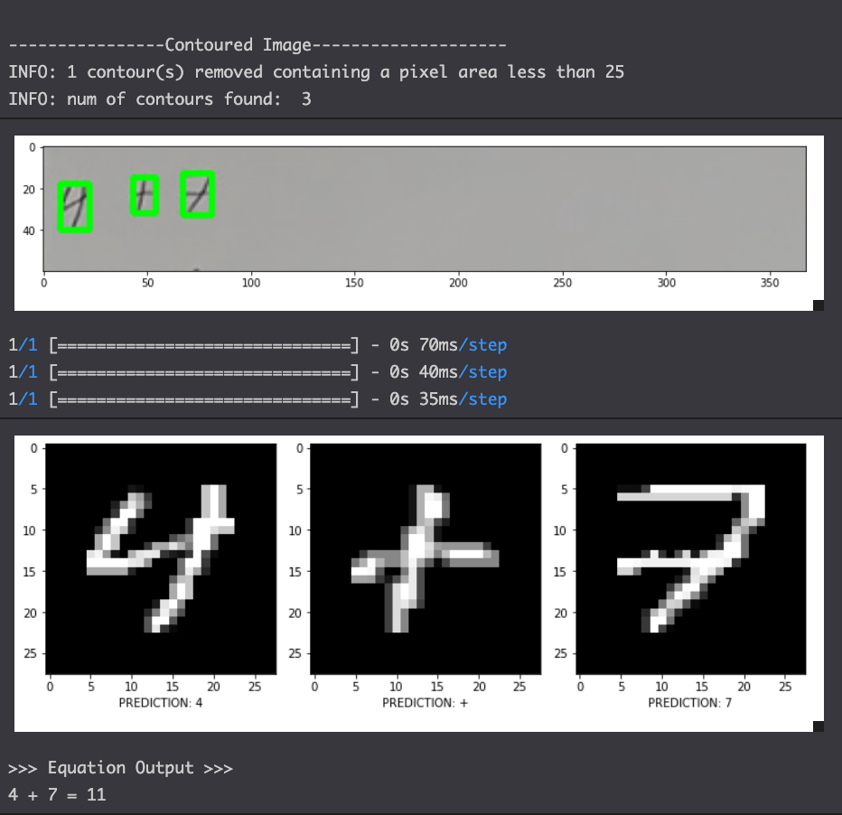

# ideal-funicular

## ML Handwritten Equation Solver
This repository reads handwritten equations and converts and solves them digitally. The image first has contours ran over the image to extract the images and operators from the original image using a preprocessing pipeline. Then, a sequntial artificial neural network then makes predictions over what operator or digit is contained within each contour. Lastly, an equation is created using the images which is then sovled and produces the outputs to the equation. Note: this current repository only handles the "+" operator as of 12/30/2022. A sample input image and outputs are displayed below: 
 
 

## Repo Set-up
- The main.py file creates the model and the datasets for the repository. Note it is NOT neccessary to run this file as it only serves the purpose of rebuilding the datasets and the model.
